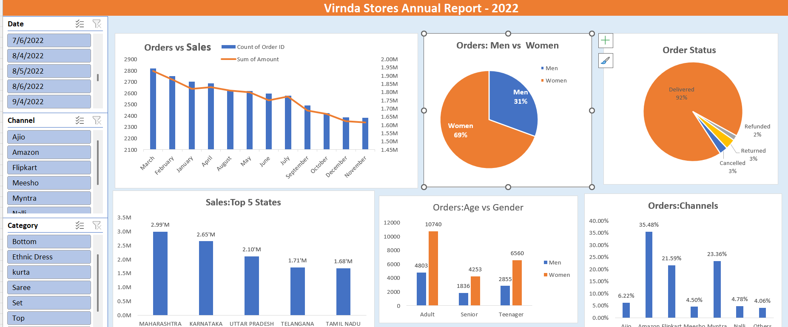

# 📊 Vrinda Store Data Analysis – Excel Dashboard Project

## 📌 Project Overview
This project analyzes Vrinda Store's sales data for the year 2022 using Microsoft Excel. The objective of the project is to understand customer behavior, identify sales trends, and generate insights that can help the business improve sales in 2023.
The analysis was performed using data cleaning, Excel formulas, pivot tables, and an interactive dashboard.

# 🎯 Objective
Vrinda Store wants to create an annual sales report for 2022 so that they can understand their customers and use those insights to *increase sales in 2023.

## Dataset used
<a href="https://github.com/shettyvicky993-maker/Data-_Analysis_Dashboard/blob/main/Vrinda%20Store%20Data%20Analysis1.xlsx">Dataset</a>
# ❓ Business Questions
The analysis answers the following business questions:
1. Compare sales and orders using a single chart
2. Which month had the highest sales and orders?
3. Who purchased more in 2022 — men or women?
4. What are the different order statuses in 2022?
5. List the top states contributing to sales
6. Relationship between age and gender based on number of orders
7. Which sales channel contributes the most sales?
8. What is the highest selling category?

Dashboard Interaction <a href="https://1drv.ms/x/c/84a551f3f3770268/IQCXackHRORYQIcl7OsicgEtAVd6tD8hLkkrxaJvhMLjuEo?e=FlnYne">View Dashboard</a>

# 🛠 Tools Used

* Microsoft Excel
* Pivot Tables
* Pivot Charts
* Excel Functions
* Data Cleaning
* Dashboard Visualization

---

# 🔧 Data Cleaning

Before analysis, the dataset was cleaned to ensure accuracy.

### Gender Standardization

The Gender column contained inconsistent values such as:

* M
* W
* Men
* Women

Using Find and Replace, these values were standardized into:

* Men
* Women

### Quantity Column Fix

The Qty column contained values stored as text.
These values were converted into numeric format to perform correct calculations.

---

# ⚙️ Data Processing

### Age Group Creation

A new column Age Group was created using the formula:

=IF(F2>=50,"Senior",IF(F2>=30,"Adult","Teenager"))

Age groups:

* Teenager (<30)
* Adult (30–49)
* Senior (50+)

### Month Column

A *Month column* was created from the order date using:

=TEXT(H2,"mmmm")

This helped analyze *monthly sales trends*.

##Dashboard

